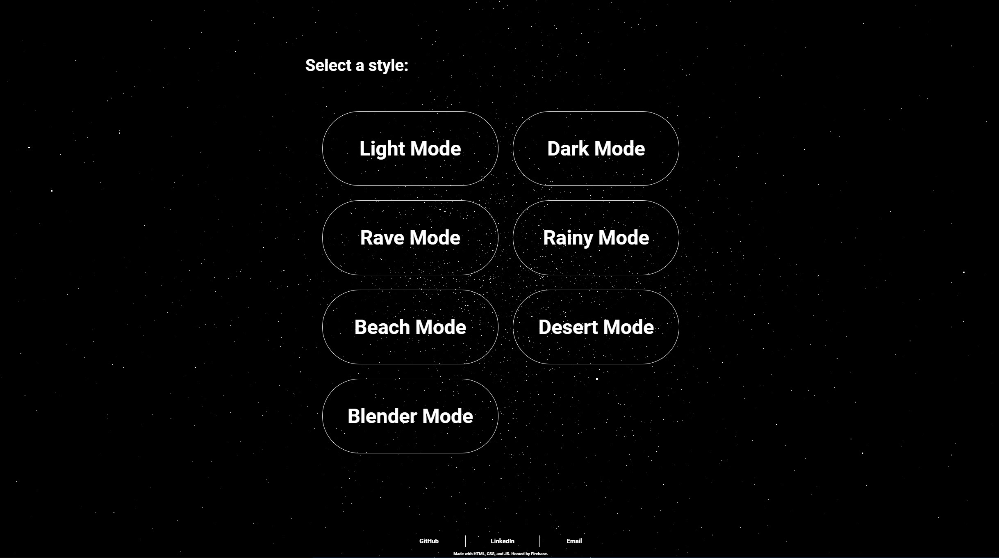
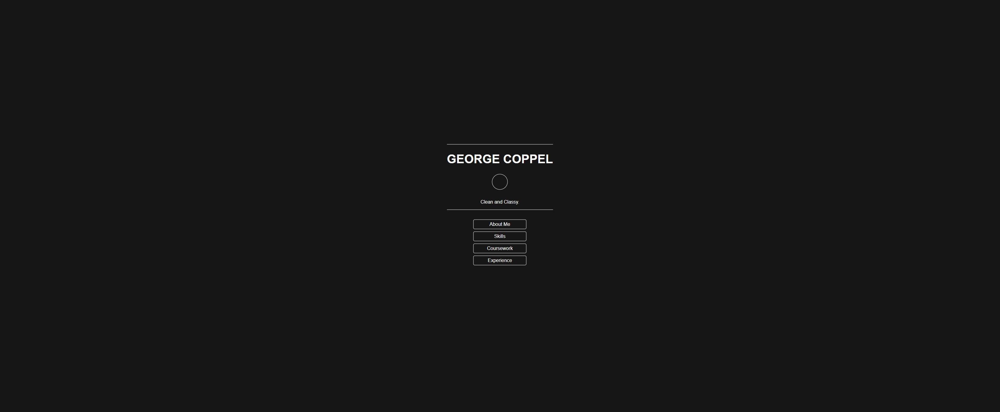
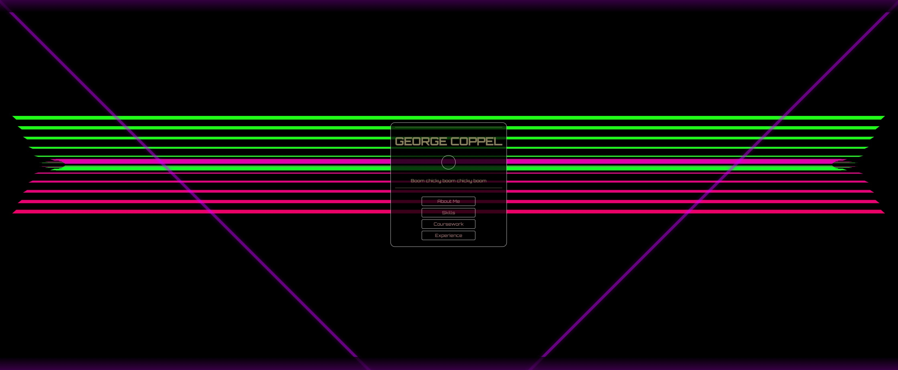
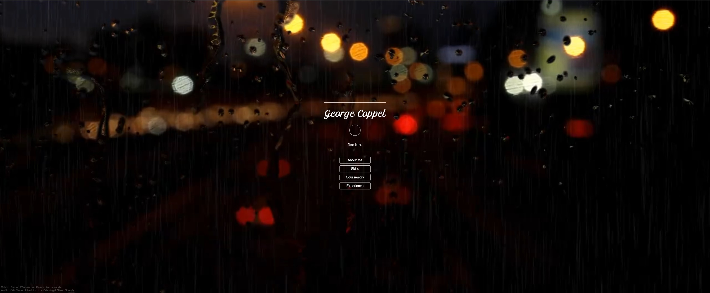
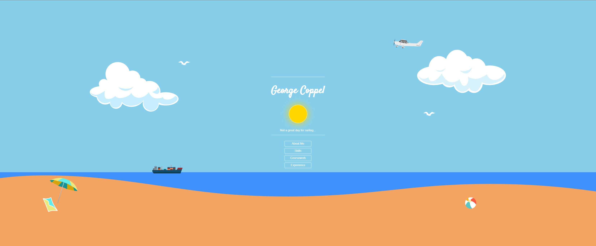
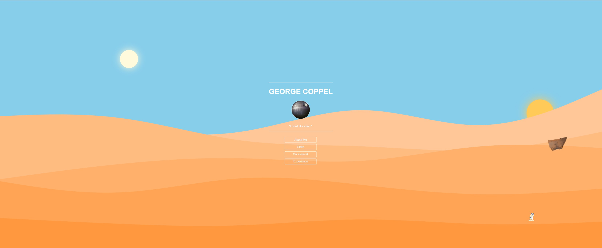
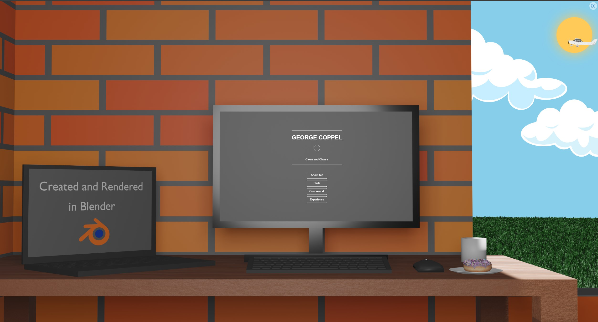

# Resume_Website_OLD

**This repository contains an old version of my personal website. The repository for the current version is linked below:**

[New Version](https://github.com/GCoppel/Resume_Website)

# [Website Link](https://georgecoppel.com)

Features:

-7 unique visual styles: Light, Dark, Rave, Rainy, Beach, Desert, Blender.

-A style-selector page with a rotating & mouse-reactive three.js particle background.

-Reactive menus, submenus, and graphics (spacing, color, text-decoration, etc.)

-Animated png graphics including planes, birds, and R2D2. 

-Audio and video (mp3 & mp4) elements.

Particle system built from "Three.js Starter" by Bruno Simon, https://threejs-journey.xyz/

# Preview Images:

